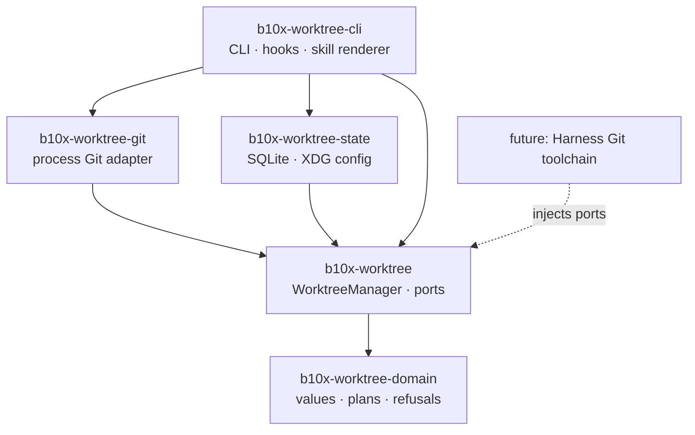
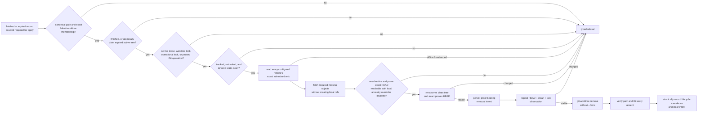

# Architecture

The workspace separates lifecycle decisions from operating-system adapters. Consumers embed the
façade and inject ports; the shipped CLI is one composition root.

The façade never depends on concrete Git, database, CLI, Atlas, or agent runtime behavior. The
domain crate performs no I/O. This dependency direction lets an embedded consumer replace process
execution and persistence without reimplementing cleanup policy.

## Cleanup proof

Dry-run garbage collection traverses the proof without claiming lifecycle state, writing the
registry, or removing a worktree; it may refresh remote advertisements and fetch missing objects
into the local object database. Apply requires the exact ids reviewed in a preceding assessment.
Final observations are repeated before mutation;
the proof-bearing removal intent makes an interruption after filesystem removal recoverable.

Remote evidence is derived from `ls-remote --refs` advertisements, so any advertised branch, tag,
pull-request ref, or custom namespace can qualify. Required missing objects are fetched with
source-only refspecs and blob filtering, then the remote is read again before ancestry is checked.
Local tags and local remote-tracking refs are never proof by themselves. Unknown, offline, dirty,
locked, live, local-only, changed, and ambiguous states retain the tree.

## Creation and membership

Activated workspace and managed roots are canonical and disjoint, and profile names are a single
path-safe component. A future managed path is canonicalized through its nearest existing ancestor,
so symlinks and parent components cannot redirect containment.

Planning resolves a user-facing revision to a full immutable commit id. Execution revalidates the
repository root, policy-derived destination, and commit before reservation. Git observations use
the repository's worktree inventory: the primary checkout and unrelated paths cannot be mistaken
for a removable linked worktree.

## Legacy reconciliation

Reconciliation dry-runs may inventory every candidate, but apply requires exact reviewed ids. An
active adopted worktree outside the managed root is migrated with non-forced `git worktree move`.
The manager records a durable relocation intent, verifies that HEAD is unchanged, and atomically
updates the registry. A later apply can complete an interrupted move when Git reports exactly one
of the recorded source or destination paths.

A finished external legacy worktree is handled differently: exact-id reconciliation may retire it
in place instead of moving it. This is the only removal path outside the ordinary GC root and is
intended for clean legacy trees on another filesystem. The same membership, lease, lock, clean
state, HEAD-stability, live remote-proof, durable-intent, and non-forced-removal gates still apply.
Apply also requires the separate `--allow-external-retirement` confirmation, preventing a reviewed
migration id from becoming an external deletion when lifecycle state changes before execution.
Finished legacy records stranded by a pre-0.3 relocation intent can take this path only when the
intent's source and HEAD still match and its destination is absent from both Git and the filesystem;
the proof-bearing removal intent retains that topology evidence until successful removal, when
completion clears both intents atomically.

When a registered path is already absent, reconciliation changes registry state only after Git no
longer reports the worktree and either a matching removal intent exists or the stored final HEAD is
freshly reachable from an advertised remote ref. A provisioning or failed record can be activated
when Git already created the exact linked tree, or tombstoned without a HEAD only when no filesystem
or Git artifact exists.

## Durable state

Activated profiles live under `$XDG_CONFIG_HOME/worktree/config.toml`. The ownership registry,
leases, lifecycle records, relocation and removal intents, and cleanup evidence live in
`$XDG_STATE_HOME/worktree/registry.sqlite3`. Managed worktrees default to
`$XDG_STATE_HOME/worktree/trees/<profile>/<repository>/<id>`.

Lifecycle transitions that race sessions are decided inside SQLite: finish records the final HEAD
only when no lease is live, expired-active cleanup atomically claims the tree as finished, legacy
migration atomically claims it as relocating, and lease acquisition succeeds only while a record
remains active. Removal completion writes lifecycle and event evidence and clears its durable intent
in one transaction.

## Versioned surfaces

| Surface | Version | Contract |
| --- | ---: | --- |
| Non-hook CLI JSON | 2 | Stable success and error envelopes with `version` and `ok`. |
| Reconciliation JSON | 2 | Includes provisioning recovery, migration, external retirement, and missing-record actions. |
| Lifecycle hooks | 1 | Session start, heartbeat, and session end remain wire-compatible. |
| Configuration and workspace policy | 1 | Existing activated profiles remain on schema version 1. |

Wire-shape changes require a new surface version. The checked-in agent skill and interface metadata
are deterministic generator output from `worktree skill`; their source of truth is the CLI
generator.
