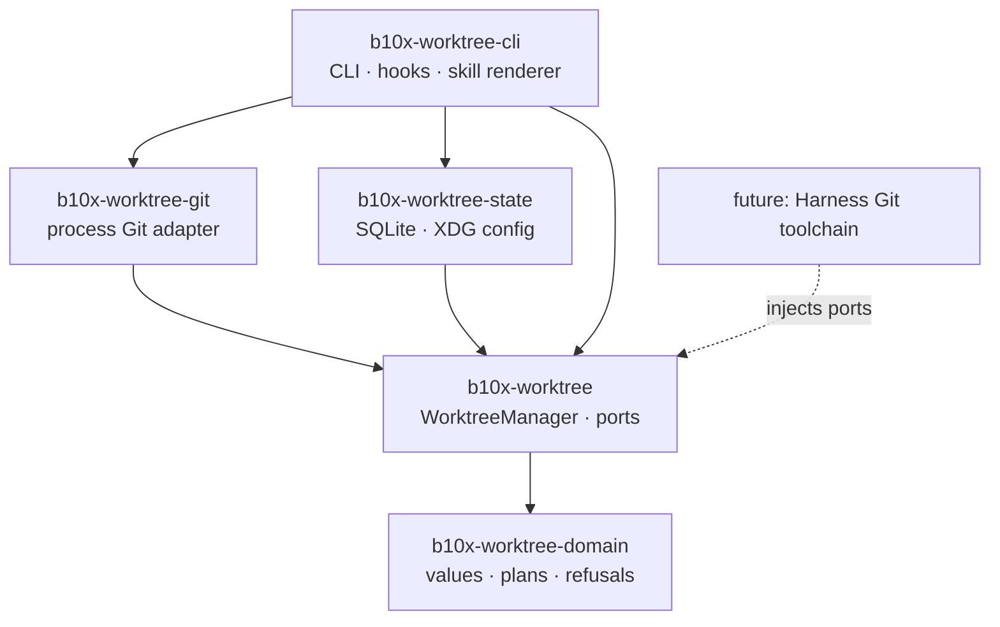
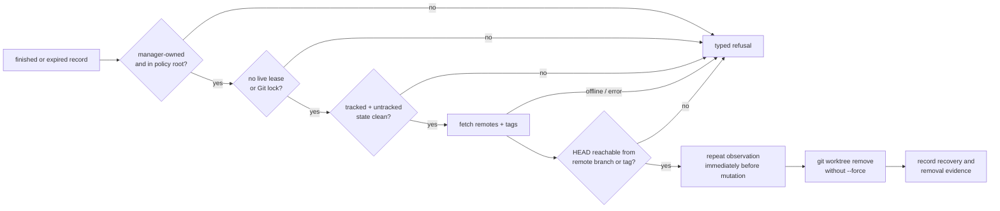

# Architecture

The workspace separates lifecycle decisions from operating-system adapters. Consumers embed the
façade and inject ports; the shipped CLI is one composition root.

The façade never depends on concrete Git, database, CLI, Atlas, or agent runtime behavior. The
domain crate performs no I/O. This dependency direction lets an embedded consumer replace process
execution and persistence without reimplementing cleanup policy.

## Cleanup proof

Dry-run garbage collection traverses the same proof but stops before revalidation and removal.
Unknown, offline, dirty, locked, live, local-only, and out-of-root states retain the tree.

## Durable state

Activated profiles live under `$XDG_CONFIG_HOME/worktree/config.toml`. The ownership registry,
leases, lifecycle records, and cleanup evidence live in
`$XDG_STATE_HOME/worktree/registry.sqlite3`. Managed worktrees default to
`$XDG_STATE_HOME/worktree/trees/<profile>/<repository>/<id>`.

The JSON and hook surface declares protocol version 1. Wire-shape changes require a new protocol
version; adding Rust API implementations can remain semver-compatible when existing contracts do
not change.
