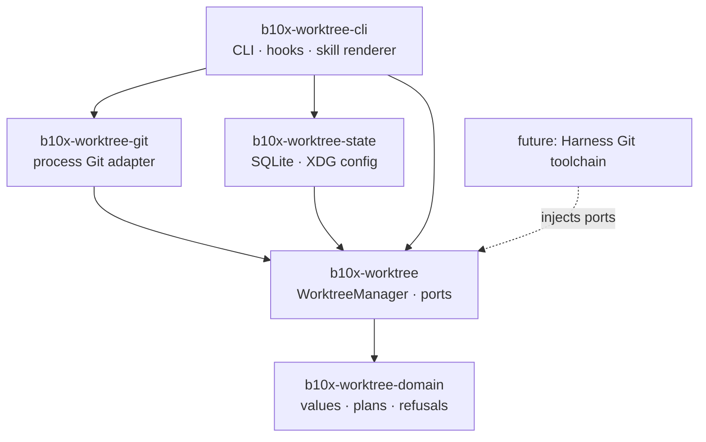
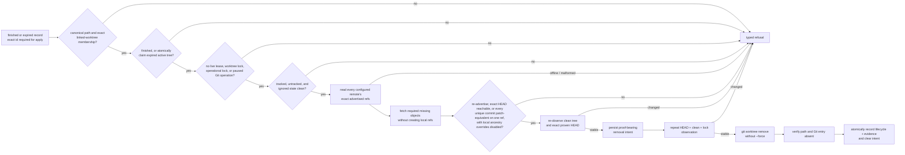
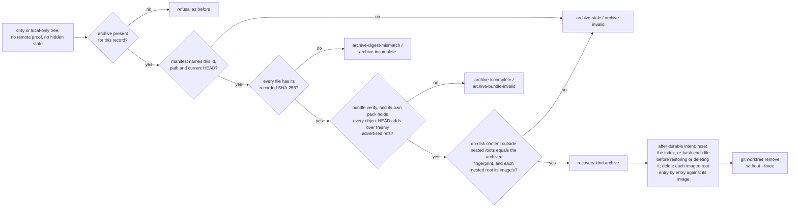
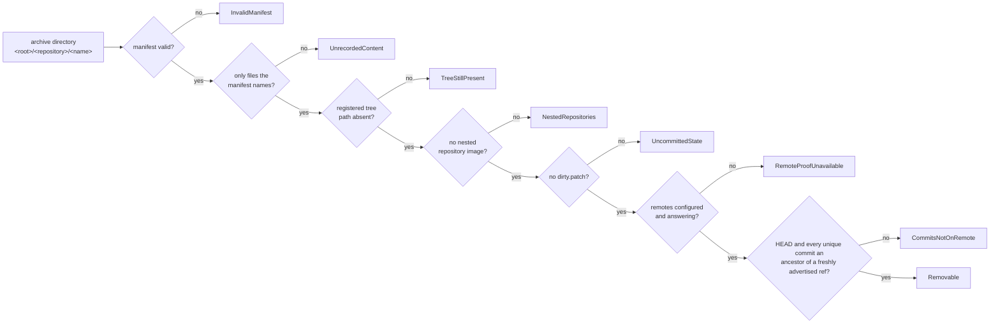
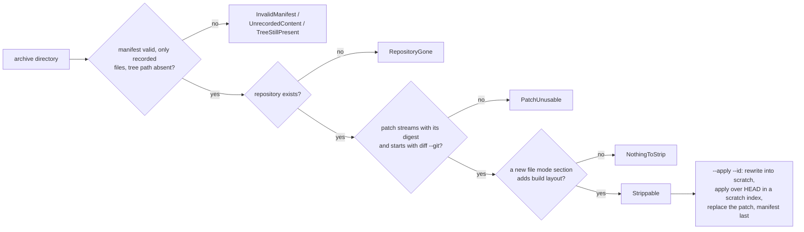

# Architecture

The workspace separates lifecycle decisions from operating-system adapters. Consumers embed the
façade and inject ports; the shipped CLI is one composition root.

```mermaid
flowchart TD
    domain["b10x-worktree-domain<br/>values · plans · refusals"]
    facade["b10x-worktree<br/>WorktreeManager · ports"]
    git["b10x-worktree-git<br/>process Git adapter"]
    state["b10x-worktree-state<br/>SQLite · XDG config"]
    cli["b10x-worktree-cli<br/>CLI · hooks · skill renderer"]
    harness["future: Harness Git toolchain"]

    facade --> domain
    git --> facade
    state --> facade
    cli --> git
    cli --> state
    cli --> facade
    harness -. injects ports .-> facade
```

The façade never depends on concrete Git, database, CLI, Atlas, or agent runtime behavior. The
domain crate performs no I/O. This dependency direction lets an embedded consumer replace process
execution and persistence without reimplementing cleanup policy.

## Cleanup proof

```mermaid
flowchart LR
    selected["finished or expired record<br/>exact id required for apply"] --> member{"canonical path and exact<br/>linked-worktree membership?"}
    member -->|no| refuse["typed refusal"]
    member -->|yes| claim{"finished, or atomically<br/>claim expired active tree?"}
    claim -->|no| refuse
    claim -->|yes| idle{"no live lease, worktree lock,<br/>operational lock, or paused Git operation?"}
    idle -->|no| refuse
    idle -->|yes| clean{"tracked, untracked, and<br/>ignored state clean?"}
    clean -->|no| refuse
    clean -->|yes| advertise["read every configured remote's<br/>exact advertised refs"]
    advertise -->|offline / malformed| refuse
    advertise --> fetch["fetch required missing objects<br/>without creating local refs"]
    fetch --> recovery{"re-advertise; exact HEAD reachable, or every<br/>unique commit patch-equivalent on one ref,<br/>with local ancestry overrides disabled?"}
    recovery -->|no| refuse
    recovery -->|yes| reobserve["re-observe clean tree<br/>and exact proven HEAD"]
    reobserve -->|changed| refuse
    reobserve -->|stable| intent["persist proof-bearing<br/>removal intent"]
    intent --> final["repeat HEAD + clean + lock<br/>observation"]
    final -->|changed| refuse
    final -->|stable| remove["git worktree remove<br/>without --force"]
    remove --> verify["verify path and Git entry absent"]
    verify --> evidence["atomically record lifecycle + evidence<br/>and clear intent"]
```

Dry-run garbage collection traverses the proof without claiming lifecycle state, writing the
registry, or removing a worktree; it may refresh remote advertisements and fetch missing objects
into the local object database. Apply requires the exact ids reviewed in a preceding assessment.
Final observations are repeated before mutation; the proof-bearing removal intent makes an
interruption after filesystem removal recoverable.

Remote evidence is derived from `ls-remote --refs` advertisements, so any advertised branch, tag,
pull-request ref, or custom namespace can qualify. Required missing objects are fetched with
source-only refspecs and blob filtering, then the remote is read again before ancestry is checked.
Local tags and local remote-tracking refs are never proof by themselves. Unknown, offline, dirty,
locked, live, local-only, changed, and ambiguous states retain the tree.

Ancestry is tried first. When no advertised ref contains the exact HEAD, the adapter lists the
commits HEAD adds over every confirmed advertised tip. Each must have exactly one parent and a
non-empty patch. One tip must then pass two checks: Git's `--cherry-pick` equivalence leaves no
commit on the HEAD side, and `git patch-id --verbatim` over `--binary` patches finds every unique
commit's whitespace-exact patch among the tip's own commits. Default branches are tried first. The
resulting proof has kind `patch-equivalent` and names the unique commits it covers; the final
re-observation before removal repeats the same two-kind check.

## Archive proof

A tree whose work may not be published is covered by a local archive instead. The Git adapter lists
the commits HEAD adds over the confirmed advertised tips with the same query patch equivalence uses,
so the archive and the recovery check cannot disagree about what is unpublished. It bundles them
from a scratch bare repository whose objects are the source's alternates, and hashes the tree's
files without filters into a scratch object directory and a scratch index. The repository gains no
ref and no object beyond the advertised objects the recovery check itself fetches, and the tree's
index is not rewritten.

A nested Git repository is listed by Git only as `<path>/` on the empty index, so neither the
scratch index nor the patch holds it. The adapter walks each such root without following symlinks,
writes its canonical listing as a GNU tar image with the `tar` crate, reads the image back and
compares the listing, and records the listing's SHA-256 as the root's fingerprint. `worktree_tree`
and `dirty.patch` cover everything outside the imaged roots and the cargo build layout left out.

Cargo build layout is decided in the domain, I/O-free: `is_build_layout` and `layout_target` take
a path below a target and an injected "is this prefix a profile directory" observation. The Git
adapter recognises the targets with `discard-cache`'s own structural classification (one walk of
the ignored entries, which now also reports each target it recognised), excludes the paths HEAD
or the index tracks, and observes profiles on disk. The capture leaves those files out of the
scratch index, so the patch and the fingerprint never see them, and the manifest records them per
target as `build_output` in format `worktree.archive/3`. Verification leaves out the same layout
only for a format 3 archive and refuses layout below a target the manifest does not name. The
discard partitions the untracked files after the index reset into layout below a recorded target
and everything else; the rest must match the archive as before, and each layout file is
re-observed as layout below the same target immediately before it is deleted.

```mermaid
flowchart LR
    tree["dirty or local-only tree,<br/>no remote proof, no hidden state"] --> archived{"archive present<br/>for this record?"}
    archived -->|no| refuse["refusal as before"]
    archived -->|yes| manifest{"manifest names this id,<br/>path and current HEAD?"}
    manifest -->|no| stale["archive-stale / archive-invalid"]
    manifest -->|yes| digests{"every file has its<br/>recorded SHA-256?"}
    digests -->|no| mismatch["archive-digest-mismatch /<br/>archive-incomplete"]
    digests -->|yes| bundle{"bundle verify, and its own pack holds<br/>every object HEAD adds over freshly<br/>advertised refs?"}
    bundle -->|no| incomplete["archive-incomplete /<br/>archive-bundle-invalid"]
    bundle -->|yes| state{"on-disk content outside nested roots equals the archived<br/>fingerprint, and each nested root its image's?"}
    state -->|no| stale
    state -->|yes| proof["recovery kind archive"]
    proof --> discard["after durable intent: reset the index, re-hash each file<br/>before restoring or deleting it; delete each imaged root<br/>entry by entry against its image"]
    discard --> remove["git worktree remove<br/>without --force"]
```

Before either kind of proof counts, the adapter refuses state `git status` does not report but
removal would destroy: assume-unchanged and skip-worktree entries (`ls-files -v`), staged content
that differs from both HEAD and the working copy, any `.git` found by walking the tree's
filesystem below its root except below a nested root the archive a removal relies on images (the
port's `hidden_state` takes that archive and re-verifies its images before skipping a root), and
refs in the per-worktree namespaces `refs/worktree/`,
`refs/bisect/` and `refs/rewritten/`.

The pack check indexes the bundle in an isolated bare repository and compares its object list with
`rev-list --objects` over the same range, because `git bundle verify` and the bundle's head list
both pass for a bundle that names HEAD but omits its parents' objects.

## Archive pruning

`prune-archives` is the one command that deletes an archive. The decision is the domain's
I/O-free `decide_archive_prune`, which takes one observation of the directory (its parsed
manifest and every entry, links not followed) and two injected observations, whether the
registered tree path exists and what the remotes hold, and checks in a fixed order. The remotes
are asked only once every local check has passed.

```mermaid
flowchart LR
    dir["archive directory<br/>&lt;root&gt;/&lt;repository&gt;/&lt;name&gt;"] --> manifest{"manifest valid?"}
    manifest -->|no| invalid["InvalidManifest"]
    manifest -->|yes| recorded{"only files the<br/>manifest names?"}
    recorded -->|no| unrecorded["UnrecordedContent"]
    recorded -->|yes| tree{"registered tree<br/>path absent?"}
    tree -->|no| present["TreeStillPresent"]
    tree -->|yes| nested{"no nested<br/>repository image?"}
    nested -->|no| images["NestedRepositories"]
    nested -->|yes| patch{"no dirty.patch?"}
    patch -->|no| dirty["UncommittedState"]
    patch -->|yes| remote{"remotes configured<br/>and answering?"}
    remote -->|no| offline["RemoteProofUnavailable"]
    remote -->|yes| held{"HEAD and every unique commit an<br/>ancestor of a freshly advertised ref?"}
    held -->|no| missing["CommitsNotOnRemote"]
    held -->|yes| removable["Removable"]
```

The remote observation is the port's `commits_not_on_remote`. The Git adapter anchors the removal
proof's own advertised-ref observation at the first recorded commit present locally, then asks plain
ancestry, with replacement objects and grafts disabled, of each recorded commit against the
confirmed tips. Patch equivalence, which removal accepts, is deliberately not consulted: an archive
whose commits are on a remote only as rebased copies is the sole copy of those commit ids.

The façade lists the archive root without following links. A directory below
`<root>/<repository>/` whose name does not start with `.` is an archive directory; every other
entry is reported as skipped. `--apply` takes exact directory names, re-reads and re-assesses each
immediately before deleting it, and the adapter's `delete_archive` then requires the manifest on
disk to equal the assessed one, removes each recorded regular file, the manifest last, and finally
the directory with a non-recursive `remove_dir`, so an entry that appeared meanwhile is kept and
refuses.

## Stripping build output from archives

`prune-archives --strip-build-output` uses the same selection and never deletes an archive. The
domain's `decide_archive_strip` shares pruning's local checks (`InvalidManifest`,
`UnrecordedContent`, `TreeStillPresent`), then asks whether the repository is gone and only then
for the patch's sections. The Git adapter's `scan_archive_patch` streams `dirty.patch` line by
line, hashing it against the recorded digest, and splits it at each `diff --git` line; a line
in a hunk starts with ` `, `+`, `-` or `\`, and a base85 line holds no space, so neither can open
a section. Each section carries its decoded path (`diff_git_path`, with Git's C-quoting undone),
whether its extended header holds `new file mode`, its patch bytes and the size of the file it
adds. The domain's `plan_patch_strip` recognises targets from the added paths alone and marks
the sections to strip. The report's prune verdict afterwards is `decide_archive_prune` over the
directory as it would be (`contents_after_strip`).

```mermaid
flowchart LR
    dir["archive directory"] --> local{"manifest valid, only recorded<br/>files, tree path absent?"}
    local -->|no| refused["InvalidManifest /<br/>UnrecordedContent / TreeStillPresent"]
    local -->|yes| repo{"repository exists?"}
    repo -->|no| gone["RepositoryGone"]
    repo -->|yes| scan{"patch streams with its digest<br/>and starts with diff --git?"}
    scan -->|no| unusable["PatchUnusable"]
    scan -->|yes| plan{"a new file mode section<br/>adds build layout?"}
    plan -->|no| nothing["NothingToStrip"]
    plan -->|yes| strippable["Strippable"]
    strippable --> apply["--apply --id: rewrite into scratch,<br/>apply over HEAD in a scratch index,<br/>replace the patch, manifest last"]
```

`strip_archive_build_output` re-reads the manifest and refuses one that changed, streams the kept
sections into a scratch directory beside the archive while re-verifying the source digest and
section count, reads HEAD's tree through scratch objects (unbundling `commits.bundle` into them
when the repository no longer holds HEAD), applies the new patch with `apply --cached` to a
scratch index and records its `write-tree` as `worktree_tree`. Only after the manifest is
re-checked does it rename the new patch over `dirty.patch` (or delete it) and rename the new
manifest into place.

## Creation and membership

Activated workspace and managed roots are canonical and disjoint, and profile names are a single
path-safe component. A future managed path is canonicalized through its nearest existing ancestor,
so symlinks and parent components cannot redirect containment.

Planning resolves a user-facing revision to a full immutable commit id. Execution revalidates the
repository root, policy-derived destination, and commit before reservation. Git observations use
the repository's worktree inventory: the primary checkout and unrelated paths cannot be mistaken
for a removable linked worktree.

## Legacy reconciliation

Reconciliation dry-runs may inventory every candidate, but apply requires exact reviewed ids. An
active adopted worktree outside the managed root is migrated with non-forced `git worktree move`.
The manager records a durable relocation intent, verifies that HEAD is unchanged, and atomically
updates the registry. A later apply can complete an interrupted move when Git reports exactly one
of the recorded source or destination paths.

A finished external legacy worktree is handled differently: exact-id reconciliation may retire it
in place instead of moving it. This is the only removal path outside the ordinary GC root and is
intended for clean legacy trees on another filesystem. The same membership, lease, lock, clean
state, HEAD-stability, live remote-proof, durable-intent, and non-forced-removal gates still apply.
Apply also requires the separate `--allow-external-retirement` confirmation, preventing a reviewed
migration id from becoming an external deletion when lifecycle state changes before execution.
Finished legacy records stranded by a pre-0.3 relocation intent can take this path only when the
intent's source and HEAD still match and its destination is absent from both Git and the filesystem;
the proof-bearing removal intent retains that topology evidence until successful removal, when
completion clears both intents atomically.

When a registered path is already absent, reconciliation changes registry state only after Git no
longer reports the worktree and either a matching removal intent exists or the stored final HEAD is
freshly proven recoverable from an advertised remote ref, by ancestry or patch equivalence. A
provisioning or failed record can be activated when Git already created the exact linked tree, or
tombstoned without a HEAD only when no filesystem or Git artifact exists.

A record whose stored HEAD is reachable from nothing is otherwise stuck forever, so an operator who
has established that the commit is gone for good may say so: a reviewed exact-id apply carrying
`--acknowledge-unrecoverable <commit>` abandons it. The assertion is checked rather than trusted.
Git must confirm that it holds no such object at all, or holds it with no local branch, tag, or
remote-tracking ref pointing at it and no remote advertising it; a surviving ref, an offline remote,
or any other ambiguous observation refuses. Abandonment removes nothing from disk and touches no
ref, because the tree is already gone, and it records no recovery proof, because it has none. It is
the one reconciliation outcome with no proof behind it, and it is deliberately reachable only by an
operator naming the exact commit being given up.

When the repository itself is gone, there is no Git left to corroborate the assertion. The Git port
reports `repository_absent` from the filesystem alone — the recorded root does not exist, or is a
directory with no `.git` — because Git run there would answer for an enclosing repository instead;
the default port never reports it. Such a record is always a `tombstone-missing` candidate, even
while its tree exists, so a workspace dry-run neither fails on it nor hides it. It is refused as
`repository-missing` until the operator acknowledges the exact recorded commit, and as
`worktree-path-exists` while the tree path or any relocation or removal intent path still exists.
Apply records the same `reconcile-abandoned` tombstone and touches nothing on disk.

## Durable state

Activated profiles live under `$XDG_CONFIG_HOME/worktree/config.toml`. The ownership registry,
leases, lifecycle records, relocation and removal intents, and cleanup evidence live in
`$XDG_STATE_HOME/worktree/registry.sqlite3`. Managed worktrees default to
`$XDG_STATE_HOME/worktree/trees/<profile>/<repository>/<id>`.

Lifecycle transitions that race sessions are decided inside SQLite: finish records the final HEAD
only when no lease is live, expired-active cleanup atomically claims the tree as finished, legacy
migration atomically claims it as relocating, and lease acquisition succeeds only while a record
remains active. Removal completion writes lifecycle and event evidence and clears its durable intent
in one transaction.

## Versioned surfaces

| Surface | Version | Contract |
| --- | ---: | --- |
| Non-hook CLI JSON | 3 | Stable success and error envelopes with `version` and `ok`; recovery proof carries `kind` and `equivalent_commits`. |
| Reconciliation JSON | 3 | Includes provisioning recovery, migration, external retirement, and missing-record actions, with version-3 recovery proof. |
| Inspection report | `worktree.inspection/2` | Proven recovery carries `kind` and `equivalent_commits`. |
| Lifecycle hooks | 1 | Session start, heartbeat, and session end remain wire-compatible. |
| Configuration and workspace policy | 1 | Existing activated profiles remain on schema version 1. |

Wire-shape changes require a new surface version. The agent skill and its interface metadata are
deterministic generator output from `worktree skill`, whose source of truth is the CLI generator.
Without `--out` it prints the skill to standard output and writes no file; `--out <dir>` writes
`SKILL.md` and `agents/openai.yaml` below that directory, and `--check` compares them. This
repository checks in no copy: the `worktree` agent plugin ships one.
